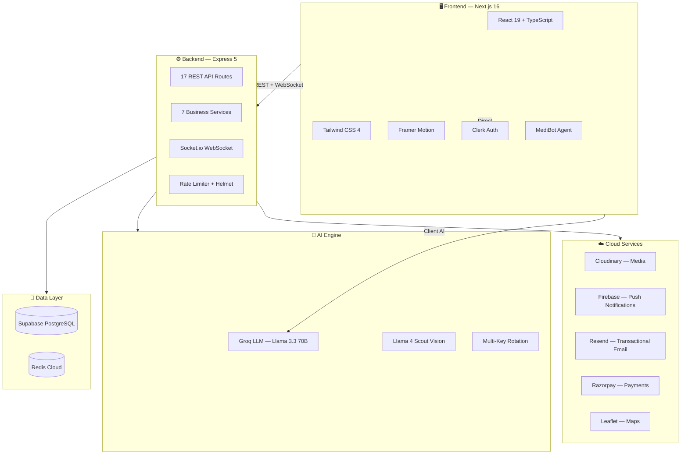

<div align="center">

# 🏥 Arogya Raksha

### AI-Powered Intelligent Healthcare Platform

**आरोग्य रक्षा** — *Your Health, Our Priority*

[](https://ai.google.dev/)
[](./LICENSE)
[](https://nextjs.org)
[](https://expressjs.com)
[](https://supabase.com)
[](https://typescriptlang.org)

<br />

**A full-stack, AI-powered healthcare platform combining agentic AI automation, real-time crisis response, and multilingual support (8 Indian languages) to deliver intelligent healthcare services for 1.4 billion people.**

[🚀 Live Demo](https://arogya-raksha.vercel.app) · [📖 Documentation](./docs/) · [🐛 Report Bug](https://github.com/ifthekharahmad69-ship-it/Arogya/issues)

</div>

---

## ✨ What Makes This Special?

> Built in **24 hours** for the Google Gemini Hackathon — This isn't a prototype. It's a **production-grade platform** with 17 API routes, 20+ pages, 7 backend services, real-time WebSocket communication, and AI-powered decision intelligence.

| Metric | Count |
|--------|-------|
| 💊 Medicines in Database | **250,000+** |
| 🏥 Health Facilities | **200,000+** |
| 🌍 Languages Supported | **8** (English, Hindi, Telugu, Tamil, Kannada, Marathi, Bengali, Bhojpuri) |
| 🤖 AI Features | **10+** |
| 🔗 API Routes | **17** |
| 📄 Frontend Pages | **20+** |
| ⚙️ Backend Services | **7** |

---

## 🎯 Core Features

<table>
<tr>
<td width="50%">

### 🤖 MediBot AI Agent
Tool-calling chatbot with **8 capabilities** — appointments, medicines, navigation, quiz, image analysis, hospitals, health tips, and document scanning.

### 🩺 AI Doctor & Symptom Checker
Symptom analysis → conditions, medicines, urgency assessment, and home remedies — all powered by Groq LLM.

### 💊 Medicine Intelligence
**250K+ medicine database** with AI-powered information retrieval and camera-based medicine scanner.

### 🏥 Hospital Discovery & Maps
**200K+ health facilities** with live geolocation, interactive Leaflet maps, and distance-based sorting.

### 📊 Health Predictors
Diabetes risk screening and medical report AI analysis with actionable insights.

</td>
<td width="50%">

### 🚨 Crisis Response System
Full end-to-end pipeline: **QR-triggered SOS → AI triage → staff dispatch → hospital bridge → real-time ambulance tracking**.

### 🧭 Healthcare Navigator
Clinical pathways, cost estimation (KNN algorithm), EMI calculator, and loan application flow with Razorpay.

### 💬 Real-time Communication
Socket.io doctor-patient messaging + WebRTC video calls + Firebase push notifications.

### 💳 Payments Integration
Razorpay integration for appointments, medicines, and healthcare financing.

### 🆔 Medical Profile & Emergency ID
Complete medical profile with QR code generation for emergency situations — auto-sends to hospitals during SOS.

</td>
</tr>
</table>

---

## 🏗 Architecture



---

## 🛠 Tech Stack

| Layer | Technologies |
|-------|-------------|
| **Frontend** | Next.js 16, React 19, TypeScript, Tailwind CSS 4, Framer Motion, Recharts |
| **Backend** | Express 5, Node.js, Socket.io, Groq SDK |
| **Database** | Supabase (PostgreSQL), Redis Cloud |
| **AI/ML** | Groq LLM (Llama 3.3 70B, Llama 4 Scout Vision), Multi-key rotation |
| **Auth** | Clerk (Google SSO + email/password) |
| **Media** | Cloudinary (images, videos, avatars) |
| **Payments** | Razorpay |
| **Notifications** | Firebase Cloud Messaging |
| **Maps** | Leaflet + OpenStreetMap + Nominatim |
| **Email** | Resend (transactional emails) |
| **Deploy** | Vercel (frontend) + Render Singapore (backend) |

---

## 🚀 Quick Start

### Prerequisites
- Node.js 18+
- npm or yarn
- [Supabase](https://supabase.com) account
- [Clerk](https://clerk.dev) account

### Setup

```bash
# 1. Clone the repo
git clone https://github.com/ifthekharahmad69-ship-it/Arogya.git
cd Arogya

# 2. Backend setup
cd backend
cp .env.example .env          # Fill in your API keys
npm install
npm run seed                   # Seed 250K+ medicines & 200K+ hospitals
npm start                      # → http://localhost:5000

# 3. Frontend setup (new terminal)
cd frontend
cp .env.example .env.local     # Fill in your keys
npm install
npm run dev                    # → http://localhost:3000
```

### Database Setup

1. Create a [Supabase](https://supabase.com) project
2. Run these SQL files in order via the SQL Editor:
   ```
   backend/schema.sql
   backend/crisis_schema.sql
   backend/medical_profile_schema.sql
   backend/doctor_profiles.sql
   backend/media_uploads.sql
   ```

---

## 📁 Project Structure

```
Arogya/
├── frontend/                       # Next.js 16 Application
│   └── src/
│       ├── app/                    # App Router (20+ pages)
│       │   ├── dashboard/          # Main dashboard with 20 sub-pages
│       │   │   ├── ai/             # MediBot AI chat
│       │   │   ├── crisis/         # Crisis command center
│       │   │   ├── symptoms/       # AI symptom checker
│       │   │   ├── medicines/      # Medicine intelligence
│       │   │   ├── hospitals/      # Hospital discovery + maps
│       │   │   ├── predictors/     # Health risk predictors
│       │   │   ├── healthcare-navigator/  # Clinical pathways
│       │   │   ├── profile/        # Medical profile + emergency ID
│       │   │   ├── video-call/     # WebRTC video consultations
│       │   │   └── ...             # 10+ more feature pages
│       │   ├── crisis/             # Public crisis report page
│       │   └── responder/          # Ambulance responder app
│       ├── components/             # 13 reusable components
│       ├── context/                # 3 React contexts (Theme, Language, Location)
│       ├── lib/                    # 8 utility modules
│       └── data/                   # Client-side datasets
│
├── backend/                        # Express 5 API Server
│   ├── routes/          (17)       # API route modules
│   ├── services/        (7)        # Business logic services
│   ├── models/          (9)        # Data models
│   ├── middleware/       (2)       # Auth middleware
│   ├── scripts/         (3)       # Database seeders
│   └── server.js                   # Entry point with Socket.io
│
├── docs/                           # Technical documentation
│   ├── Arogya_Raksha_Master_Documentation.md
│   ├── 01_Healthcare_Navigator_Documentation.md
│   ├── 02_AI_Doctor_Symptom_Checker_Documentation.md
│   ├── 03_Medicine_Intelligence_Documentation.md
│   ├── 04_Hospital_Discovery_Maps_Documentation.md
│   └── 05_Crisis_Response_Emergency_Documentation.md
│
├── CONTRIBUTING.md                 # Contributing guide
├── LICENSE                         # MIT License
└── render.yaml                     # Render deployment config
```

---

## 🔒 Security

- **Clerk Auth** — Google SSO + email/password authentication
- **Rate Limiting** — 500 req/15min (API), 30 req/15min (auth endpoints)
- **Helmet** — Security headers
- **CORS** — Whitelist with Vercel preview support
- **Gzip Compression** — 60-80% response size reduction
- **Redis-backed** — Rate limiting per IP
- **50MB** — Request body limit for media uploads

---

## 📚 Documentation

| Document | Description |
|----------|-------------|
| [Master Documentation](./docs/Arogya_Raksha_Master_Documentation.md) | Complete system reference |
| [Healthcare Navigator](./docs/01_Healthcare_Navigator_Documentation.md) | Clinical pathways & cost estimation |
| [AI Doctor](./docs/02_AI_Doctor_Symptom_Checker_Documentation.md) | Symptom analysis pipeline |
| [Medicine Intelligence](./docs/03_Medicine_Intelligence_Documentation.md) | 250K+ medicine database |
| [Hospital Discovery](./docs/04_Hospital_Discovery_Maps_Documentation.md) | Geolocation & interactive maps |
| [Crisis Response](./docs/05_Crisis_Response_Emergency_Documentation.md) | End-to-end emergency pipeline |

---

## 🌍 Multilingual Support

| Language | Code | Region |
|----------|------|--------|
| English | `en` | Pan-India |
| हिंदी (Hindi) | `hi` | North India |
| తెలుగు (Telugu) | `te` | Andhra Pradesh, Telangana |
| தமிழ் (Tamil) | `ta` | Tamil Nadu |
| ಕನ್ನಡ (Kannada) | `kn` | Karnataka |
| मराठी (Marathi) | `mr` | Maharashtra |
| বাংলা (Bengali) | `bn` | West Bengal |
| भोजपुरी (Bhojpuri) | `bho` | Bihar, UP |

---

## 👥 Team SSRRK

Built with ❤️ for the **Google Gemini Hackathon 2026**

---

<div align="center">

**Arogya Raksha — Intelligent Healthcare for 1.4 Billion People** 🇮🇳

[](https://github.com/ifthekharahmad69-ship-it/Arogya)

</div>
