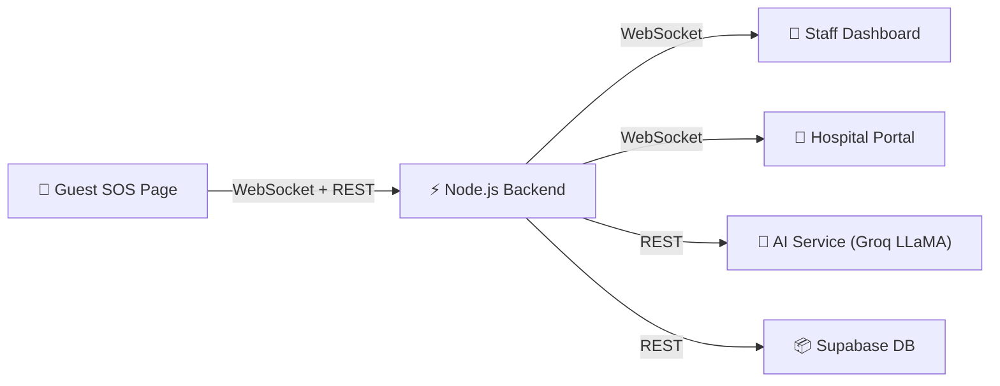
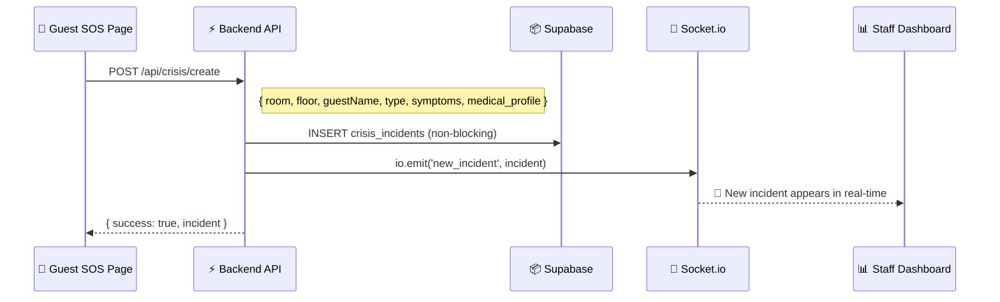
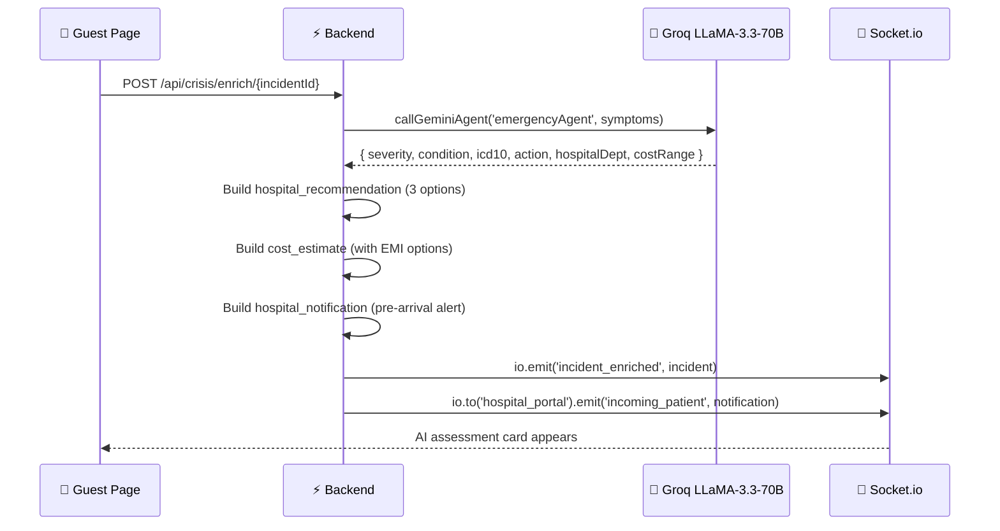
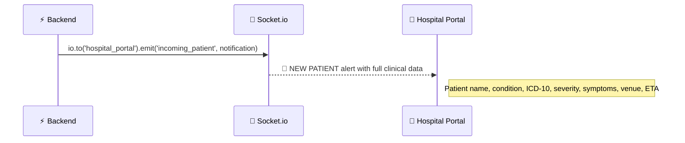
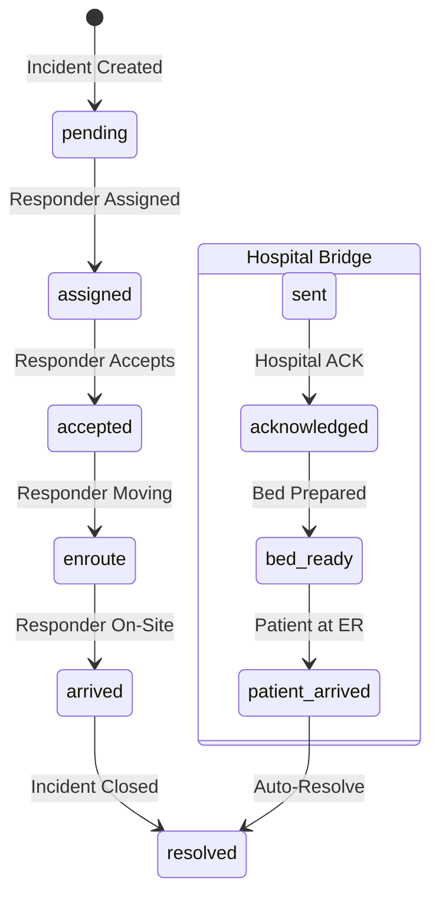

# 🚨 Rapid Crisis Response — Complete Architecture Flow

## System Overview

The Rapid Crisis Response is a **10-step, real-time emergency pipeline** connecting three independent portals through a unified backend powered by **Socket.io WebSockets + REST APIs + AI enrichment**.



---

## The 3 Portals

| Portal | URL | File | Purpose |
|--------|-----|------|---------|
| **Guest SOS** | `/crisis/report` | [page.tsx](file:///c:/Users/ACER/OneDrive/Desktop/ssrrk/frontend/src/app/crisis/report/page.tsx) | Guest-facing emergency form + live tracking |
| **Staff Dashboard** | `/dashboard/crisis` | [page.tsx](file:///c:/Users/ACER/OneDrive/Desktop/ssrrk/frontend/src/app/dashboard/crisis/page.tsx) | Hotel command center for incident management |
| **Hospital Portal** | `/hospital/portal` | [page.tsx](file:///c:/Users/ACER/OneDrive/Desktop/ssrrk/frontend/src/app/hospital/portal/page.tsx) | Hospital ER receives pre-arrival alerts |

---

## Step-by-Step Flow

### STEP 1 — QR Code Trigger (Entry Point)

```
Guest scans QR code in hotel room
  → URL: /crisis/report?room=305&floor=3&hotel=HOTEL_001
  → Room & Floor are AUTO-FILLED into the emergency form
```

**How QR Codes Are Generated:**
- [QR Generator Page](file:///c:/Users/ACER/OneDrive/Desktop/ssrrk/frontend/src/app/dashboard/crisis/qr/page.tsx) at `/dashboard/crisis/qr`
- Uses `qrcode.react` library to encode room-specific URLs
- Supports single room, bulk range (101–110), and print-to-PDF
- Each QR encodes: `{BASE_URL}/crisis/report?room={room}&floor={floor}&hotel={hotelId}`

**Backend QR endpoint:** `GET /api/crisis/qr?room=305&floor=3&hotel=HOTEL_001`

> [!NOTE]
> If no QR code is scanned, the guest can still manually open `/crisis/report` and click the **🚨 EMERGENCY** button → fill the form manually.

---

### STEP 2 — Incident Creation

**Guest fills form and hits "SEND EMERGENCY ALERT"**



**Key data sent:**
```json
{
  "room": "305",
  "floor": "3",
  "guestName": "Rahul Kumar",
  "type": "medical",
  "symptoms": "chest pain, difficulty breathing",
  "medical_profile": {
    "blood_group": "O+",
    "conditions": "Diabetes Type 2",
    "medications": "Metformin 500mg",
    "allergies": "Penicillin",
    "bp": "140/90",
    "emergency_contact": "Priya Kumar (+91 98765 43210)"
  }
}
```

> [!IMPORTANT]
> The guest's **medical profile is auto-loaded** from Supabase via `GET /api/medical-profile/emergency-card` using their Clerk user ID. Blood group, conditions, medications, allergies, and emergency contacts are attached to the incident automatically.

**Incident Object Created:**
- Unique ID: `INC{timestamp}` (e.g., `INC847291`)
- Status: `pending`
- Severity: `assessing`
- Ambulance alert: webhook-ready (Twilio stub)
- Fallback: SMS via Twilio after 30s timeout

**Backend file:** [crisis.js L31-101](file:///c:/Users/ACER/OneDrive/Desktop/ssrrk/backend/routes/crisis.js#L31-L101)

---

### STEP 3 — AI Enrichment (ICD-10 + Severity Assessment)

**Automatically triggered 2 seconds after incident creation.**



**What the AI returns:**
```json
{
  "severity": "high",
  "condition": "Acute Coronary Syndrome suspected",
  "icd10": "I21.9",
  "action": "Keep patient seated upright, loosen clothing, prepare aspirin if available",
  "hospitalDept": "Emergency / Cardiology",
  "costRange": "₹15,000 – ₹45,000"
}
```

**What the backend adds:**
| Data Block | Contents |
|------------|----------|
| `hospital_recommendation` | 3 hospitals ranked: Primary (best), Nearest (closest), Budget (govt) |
| `cost_estimate` | Cost range + 3 EMI options (6/12/18 month) + loan availability |
| `hospital_notification` | Pre-arrival packet with patient name, condition, ICD-10, symptoms, venue, ETA |
| `ambulance_alert` | Webhook-ready Twilio emergency bridge |

**Backend file:** [crisis.js L106-223](file:///c:/Users/ACER/OneDrive/Desktop/ssrrk/backend/routes/crisis.js#L106-L223)
**AI Service:** [aiService.js](file:///c:/Users/ACER/OneDrive/Desktop/ssrrk/backend/services/aiService.js) — `emergencyAgent` prompt

---

### STEP 4 — Staff Dashboard (Live Command Center)

**All incidents appear in real-time on the Staff Dashboard at `/dashboard/crisis`.**

The dashboard shows:
- **KPI Stats**: Active incidents, Critical/High count, Resolved today, Staff available
- **Live Incident List** (left panel): Color-coded by severity & status
- **Incident Detail Panel** (right panel): AI assessment, responder, hospital intelligence, cost/EMI, real-time chat

**Staff can:**
1. Click any incident to view full details
2. Auto-assign or manually select a responder
3. Advance status: `pending → assigned → accepted → enroute → arrived → resolved`
4. Send real-time chat messages to the guest
5. Open Hospital Portal in a new tab to coordinate

**Socket.io events the dashboard listens to:**
| Event | Trigger |
|-------|---------|
| `new_incident` | New SOS created |
| `incident_enriched` | AI assessment complete |
| `incident_assigned` | Responder assigned |
| `incident_status_update` | Status changed |
| `incident_message` | Chat message received |
| `hospital_acknowledged` | Hospital confirms receipt |
| `hospital_bed_ready` | Hospital bed prepared |

**Frontend file:** [crisis/page.tsx](file:///c:/Users/ACER/OneDrive/Desktop/ssrrk/frontend/src/app/dashboard/crisis/page.tsx)

---

### STEP 5 — Smart Staff Assignment

**Automatic or manual assignment of hotel staff responders.**

```
POST /api/crisis/assign/{incidentId}
  → If no responderId specified: AUTO-ASSIGN
      → Medical emergency → prioritize "In-House Doctor"
      → Non-medical → prioritize "Security Guard"
      → Fallback: any available responder
  → Marks responder as 'busy'
  → Emits: io.emit('incident_assigned', incident)
  → Emits: io.emit('responder_alert_{responderId}', alert)
```

**Mock Responders (5 staff members):**
| ID | Name | Role | Default Status |
|----|------|------|----------------|
| R001 | Arjun Sharma | Security Guard | available |
| R002 | Priya Nair | Floor Manager | available |
| R003 | Dr. Mehta | In-House Doctor | available |
| R004 | Suresh Kumar | Security Guard | busy |
| R005 | Ananya Singh | Duty Manager | available |

**Backend file:** [crisis.js L228-284](file:///c:/Users/ACER/OneDrive/Desktop/ssrrk/backend/routes/crisis.js#L228-L284)

---

### STEP 6 — Guest Live Tracking View

**After the alert is sent, the guest sees a live tracking page with:**

1. **Status Timeline** — 6-step progress bar:
   `pending → assigned → accepted → enroute → arrived → resolved`
2. **AI Assessment Card** — Severity, condition, ICD-10, first-aid instructions
3. **Assigned Responder** — Name, role, status (Notified/Accepted/Enroute/Arrived)
4. **Live Ambulance Map** — Real-time GPS tracking via Leaflet (component: `AmbulanceMap`)
5. **Hospital Intelligence** — 3 recommended hospitals with distance
6. **Cost Estimate + EMI** — Estimated cost range with 3 EMI options + "Apply for Medical Loan" button
7. **Real-Time Chat** — Guest can send messages to hotel staff via Socket.io
8. **Emergency Call Buttons** — Direct call links: Ambulance 108, Emergency 112

**Auto-progression (demo mode):**
```
assigned  →  accepted   (after 12 seconds)
accepted  →  enroute    (after 25 seconds)
enroute   →  arrived    (after 45 seconds)
```

**Frontend file:** [crisis/report/page.tsx L535-775](file:///c:/Users/ACER/OneDrive/Desktop/ssrrk/frontend/src/app/crisis/report/page.tsx#L535-L775)

---

### STEP 7 — Real-Time Chat (Incident Communication)

**Bidirectional messaging between Guest ↔ Staff ↔ Hospital via Socket.io.**

```
POST /api/crisis/chat/{incidentId}
  Body: { sender, senderRole, text }
  → Persists message to incident.messages[]
  → io.to('incident_{id}').emit('incident_message', message)
```

**Three chat roles:**
- `guest` — Messages from the guest (right-aligned, blue)
- `admin` — Messages from hotel staff (left-aligned, indigo)
- `system` — Auto-generated notifications (center, amber)
- `hospital` — Messages from hospital portal (left-aligned, with 🏥 prefix)

**Backend file:** [crisis.js L334-359](file:///c:/Users/ACER/OneDrive/Desktop/ssrrk/backend/routes/crisis.js#L334-L359)

---

### STEP 8 — Hospital Pre-Arrival Alert (Hotel → Hospital Bridge)

**When AI enrichment completes, a pre-arrival alert is automatically sent to the hospital portal.**



**Hospital Notification Payload:**
```json
{
  "id": "HN1715709600000",
  "incident_id": "INC847291",
  "hospital": "Apollo Emergency Care",
  "hospital_dept": "Emergency / Cardiology",
  "patient": {
    "name": "Rahul Kumar",
    "condition": "Acute Coronary Syndrome suspected",
    "icd10": "I21.9",
    "severity": "high",
    "symptoms": "chest pain, difficulty breathing",
    "action_taken": "Keep patient seated upright...",
    "venue": "Room 305, Floor 3",
    "estimated_arrival": "10-15 minutes"
  },
  "webhook": {
    "endpoint": "https://hospital-his-api.example.com/incoming-patient",
    "status": "webhook_ready"
  }
}
```

---

### STEP 9 — Hospital Response Actions (Hospital Portal)

**The hospital portal at `/hospital/portal` receives the alert and processes it through 3 sequential actions:**

| Step | Action | API Endpoint | Socket.io Event |
|------|--------|-------------|-----------------|
| **1. Acknowledge** | Hospital confirms receipt, assigns bed | `POST /api/crisis/hospital/acknowledge/{incidentId}` | `hospital_acknowledged` |
| **2. Bed Ready** | ER team prepared, bed number confirmed | `POST /api/crisis/hospital/bed-ready/{incidentId}` | `hospital_bed_ready` |
| **3. Patient Arrived** | Patient physically at hospital → loop closed | `POST /api/crisis/hospital/patient-arrived/{incidentId}` | `incident_status_update` (resolved) |

**Each action sends a real-time message to the guest's chat:**
- Acknowledge: *"🏥 Hospital Ready: Bed ER-A02 prepared in Emergency. Please proceed immediately."*
- Bed Ready: *"🛏️ Bed ER-A02 is now prepared and Cardiology team is on standby."*
- Patient Arrived: *"✅ Patient Rahul Kumar has arrived at Apollo Emergency Care and is now under medical care."*

**Hospital Portal Features:**
- KPI dashboard: Incoming alerts, Awaiting action, Beds prepared, Patients arrived
- Patient detail panel with clinical data + ICD-10 + venue staff info
- Bed/Room input + ER responder assignment
- Integration info showing webhook endpoint for HIS (Hospital Information System)

**Backend files:** [crisis.js L399-537](file:///c:/Users/ACER/OneDrive/Desktop/ssrrk/backend/routes/crisis.js#L399-L537)

---

### STEP 10 — Resolution & Loop Closure

**The incident is fully resolved when either:**
1. Hotel staff marks status as `resolved` on the Staff Dashboard
2. Hospital marks `patient_arrived` on the Hospital Portal (auto-resolves)

**On resolution:**
- Response time is calculated: `resolved_at - created_at`
- Responder status is freed back to `available`
- Guest sees a "Incident Resolved ✅" screen with response time
- All 3 portals are updated in real-time

```
resolved_at - created_at = response_time_minutes
responder.status = 'available' (freed for next incident)
Guest → "Incident Resolved ✅" screen
```

---

## Complete API Endpoints

| Method | Endpoint | Step | Purpose |
|--------|----------|------|---------|
| `GET` | `/api/crisis/qr` | 1 | QR config for room-based trigger |
| `POST` | `/api/crisis/create` | 2 | Create new incident |
| `POST` | `/api/crisis/enrich/{id}` | 3 | AI enrichment (ICD-10 + severity) |
| `GET` | `/api/crisis/incidents` | 4 | List all incidents |
| `GET` | `/api/crisis/incidents/{id}` | 4 | Get single incident |
| `POST` | `/api/crisis/assign/{id}` | 5 | Assign responder |
| `POST` | `/api/crisis/status/{id}` | 6 | Update incident status |
| `POST` | `/api/crisis/chat/{id}` | 7 | Send chat message |
| `GET` | `/api/crisis/responders` | 5 | List all staff responders |
| `GET` | `/api/crisis/hospital/notifications` | 8 | Hospital: get all alerts |
| `POST` | `/api/crisis/hospital/acknowledge/{id}` | 9 | Hospital: acknowledge alert |
| `POST` | `/api/crisis/hospital/bed-ready/{id}` | 9 | Hospital: mark bed ready |
| `POST` | `/api/crisis/hospital/patient-arrived/{id}` | 10 | Hospital: patient arrived |

---

## Socket.io Events

| Event | Direction | Emitter | Listener |
|-------|-----------|---------|----------|
| `new_incident` | Backend → All | `crisis/create` | Staff Dashboard |
| `incident_enriched` | Backend → All | `crisis/enrich` | Staff Dashboard, Guest SOS |
| `incident_assigned` | Backend → All | `crisis/assign` | Staff Dashboard, Guest SOS |
| `incident_status_update` | Backend → All | `crisis/status` | All 3 portals |
| `incident_message` | Backend → Room | `crisis/chat` | Guest SOS, Staff Dashboard |
| `incoming_patient` | Backend → Hospital | `crisis/enrich` | Hospital Portal |
| `hospital_acknowledged` | Backend → All | `hospital/acknowledge` | Staff Dashboard, Guest SOS |
| `hospital_bed_ready` | Backend → All | `hospital/bed-ready` | Staff Dashboard |
| `responder_alert_{id}` | Backend → Responder | `crisis/assign` | Responder App |
| `join_incident` | Client → Backend | Guest/Staff client | Joins Socket.io room |

---

## Status State Machine



---

## Tech Stack

| Layer | Technology | Purpose |
|-------|------------|---------|
| **Frontend** | Next.js 14 (App Router) | SSR + client-side SPA |
| **Real-Time** | Socket.io | WebSocket for live updates |
| **Backend** | Express.js (Node.js) | REST API + Socket.io server |
| **AI Engine** | Groq API + LLaMA 3.3 70B | Emergency severity assessment |
| **Database** | Supabase (PostgreSQL) | Incident persistence (non-blocking) |
| **Auth** | Clerk | Guest identity for medical profile |
| **Maps** | Leaflet.js | Live ambulance GPS tracking |
| **QR Codes** | qrcode.react | Room-specific QR generation |
| **Fallback** | Twilio (webhook-ready) | SMS fallback if WebSocket fails |

---

## File Map

```
backend/
├── server.js                    # Express + Socket.io setup
├── ioInstance.js                 # Socket.io singleton
├── routes/
│   └── crisis.js                # All 13 crisis API endpoints (540 lines)
└── services/
    └── aiService.js             # Groq AI with emergencyAgent prompt

frontend/src/app/
├── crisis/
│   └── report/
│       └── page.tsx             # Guest SOS page (789 lines)
├── dashboard/
│   ├── crisis/
│   │   ├── page.tsx             # Staff Command Center (632 lines)
│   │   └── qr/
│   │       └── page.tsx         # QR Code Generator (356 lines)
│   └── emergency/
│       └── page.tsx             # Emergency services (ambulance booking)
└── hospital/
    └── portal/
        └── page.tsx             # Hospital ER Portal (500 lines)

frontend/src/components/
└── AmbulanceMap.tsx             # Live GPS ambulance tracking
```

---

## Resilience & Fallbacks

| Scenario | Fallback |
|----------|----------|
| Backend unreachable | Demo mode: incident created locally, mock AI enrichment, auto-progress |
| AI (Groq) timeout | Default enrichment with generic severity + ICD-10 |
| Supabase unavailable | In-memory `incidentStore` (Map) — no data loss during session |
| WebSocket disconnects | HTTP polling fallback (Socket.io auto-retry) |
| SMS fallback | Twilio webhook-ready architecture (fires after 30s timeout) |
| Hospital HIS offline | Webhook-ready payload stored, retryable |

> [!TIP]
> The entire crisis flow works in **demo mode** even without the backend — the guest page creates a local incident, injects mock AI assessment, and auto-progresses through all 6 status steps. This makes it **presentation-safe** for hackathon demos.
